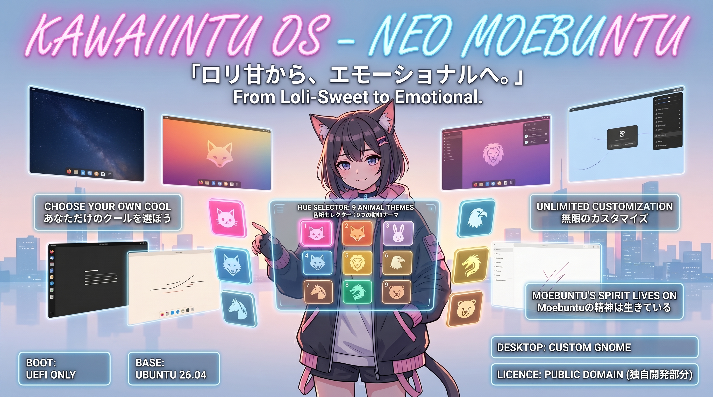

# 🌸 Kawaiintu OS (Neo Moebuntu)

**Kawaiintu UEFI MODE Distribution**

**「ロリ甘から、エモーショナルへ。」**
*(From Loli-Sweet to Emotional.)*

A next-generation custom Ubuntu distro inheriting Moebuntu. Evolved into an "Emo & Cool" aesthetic with dynamic 9-color hue rotation.
Moebuntuの系譜を継承しつつ、独自のPython色相回転ギミックにより、新たな「エモくてかっこいい」世界観へと進化した次世代カスタムOS。

---

## ✨ Features / 主な特徴

<!-- 9色のテーマバナー（3x3のグリッド表示：絶対パス版） -->

  
  
  

  
  
  

  
  
  

- 🎨 **Non-Destructive UI Theming (GTK4 Bypass):**
  We bypassed the strict GTK4/libadwaita theming limits safely. Our custom Python daemon dynamically hooks into UI selectors to rotate colors on the fly, crafting 9 distinct themes without breaking system CSS files.
  (独自のPythonデーモンにより、GTK4/libadwaitaの厳格なテーマ制限を非破壊で回避。システムファイルを壊すことなく、9色の美しい色相回転ギミックを実現しました。)

- 🐾 **Animal Motifs:**
  Each of the 9 color themes corresponds to a specific animal, adding a playful yet stylish touch to your desktop experience.
  (それぞれのテーマカラーには動物のモチーフが対応しており、遊び心とスタイリッシュさを両立。)

- 🌍 **Borderless Experience (True Multilingual Support):**
  Zero friction for global users. Powered by the highly acclaimed Calamares installer, Kawaiintu delivers a flawless, out-of-the-box multilingual experience. Set your native language, timezone, and precise keyboard layout effortlessly right from the initial setup screen.
  (国境を越えるOS体験を。世界中で高く評価されているCalamaresインストーラーの採用により、煩わしいロケール設定の壁を排除しました。インストール画面から母国語やキーボードレイアウトを選ぶだけで、あなたの言語環境に完全に最適化された状態で使い始められます。)

- 🕶️ **Cool Login Screen:**
  A sleek and highly polished login screen that sets an "emo and cool" mood right from the moment you boot up.
  (起動した瞬間から「エモくてかっこいい」世界観を演出する、クールなログイン画面。)

- 🛠️ **Ultimate Freedom (True to Moebuntu's Spirit):**
  While it looks perfectly configured out of the box, you still have complete freedom to change the Plymouth (boot animation), Login screen, and Wallpapers to whatever you desire.
  (初期状態で完成されたデザインでありながら、Moebuntuと同様にPlymouth、ログイン画面、背景画像はユーザーの好みに合わせて自由に変更可能。着せ替えの自由度はそのままです。)

- ⚡ **Modern Architecture:**
  Optimized exclusively for UEFI boot mode.
  (UEFIモード専用に最適化されたモダンな環境。)

---

## 📥 Download / ダウンロード

You can download the latest ISO image from the Internet Archive link below.
最新のISOイメージは、以下のInternet Archiveリンクからダウンロード（直リンク/Torrent）できます。

👉 **[[Download Kawaiintu ISO (Internet Archive)](https://archive.org/details/kawaiintu-uefi)]**

*(Note: We recommend using Torrent for faster and more stable downloads.)*
*(※大容量ファイルのため、高速で安定したTorrent経由でのダウンロードを強く推奨します。)*

---

## 💻 Installation / インストール方法

1. Download the ISO file from the link above.
   (上記のリンクからISOファイルをダウンロードします。)
2. Write the ISO to a USB drive using tools like [Rufus](https://rufus.ie/) or [balenaEtcher](https://balena.io/etcher/).
   (RufusやbalenaEtcherなどのツールを使用して、USBメモリに書き込みます。)
3. Boot your PC from the USB drive in **UEFI mode**.
   (PCを**UEFIモード**でUSBから起動します。)
4. Follow the Calamares installer to setup Kawaiintu.
   (Calamaresインストーラーの指示に従ってインストールを完了してください。)

---

## 📜 License / ライセンス

**独自開発部分：パブリックドメイン (Public Domain / CC0)**
このプロジェクトにおいて独自に作成・設定された部分（Pythonスクリプト、GTK設定、独自テーマなど）は、パブリックドメインとして公開されています。作者への許可やクレジット表記なしで、複製、改変、配布、商用利用が自由に可能です。
*(The original configurations, Python scripts, and custom themes created for this project are dedicated to the public domain.)*

**ベースシステム：各オープンソースライセンスに準拠**
ベースとなるUbuntuシステム、および同梱されている各種ソフトウェア（GNOME環境や各パッケージなど）の著作権は放棄されていません。これらはそれぞれの開発元が定める元のライセンス（GPLなど）に準拠します。
*(The underlying Ubuntu system and included software packages retain their original licenses, such as GPL.)*e packages retain their original licenses, such as GPL.)*
